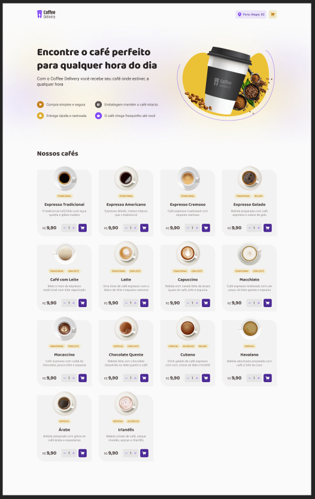

# Coffee Delivery

Essa é uma solução para o desafio técnico do nível da trilha de React da Rocketseat. Este projeto é uma aplicação de e-commerce onde é possível produtos (cafés) disponíveis para compra, adicionar uma quantidade específicas de itens no carrinho, aumentar ou remover a quantidade de itens no carrinho. Além disso, a quantidade de itens são mostrados no Header da aplicação.



## Índice

- [Visão Geral](#visao-geral)
  - [O desafio](#o-desafio)
  - [Links](#links)
- [Meu processo](#meu-process)
  - [Funcionalidades](#funcionalidades)
  - [Tecnologias Utilizadas](#tecnologias-utilizadas)
  - [Tecnologias Utilizadas](#tecnologias-utilizadas)
- [Como rodar o projeto](#como-rodar-o-projeto)
- [Autor](#autor)

## Visão Geral

### O desafio

Requisitos do desafio:

- Listagem de produtos (cafés) disponíveis para compra
- Adicionar uma quantidade específicas de itens no carrinho
- Aumentar ou remover a quantidade de itens no carrinho
- Formulário para o usuário preencher o seu endereço
- Exibir o total de itens no carrinho no Header
- Exibir o valor total da soma de itens no carrinho multiplicados pelo valor

## Meu processo

### Funcionalidades

- **Adicionar ao Carrinho:** Os usuários podem adicionar produtos ao carrinho clicando no botão com ícone de carrinho.
- **Adicionar ao quantidade específica ao Carrinho:** Os usuários podem adicionar produtos ao carrinho clicando no botão de "+" ou "-" antes de .
- **Remover do Carrinho:** Produtos no carrinho podem ser removidos ao clicar o no botão de "Remover" no Checkout.
- **Total de itens exibidos no Header:** O total de itens adicionados ao carrinho são exibidos no Header, acima do ícone de carrinho.
- **Formulário para usuário preencher dados:** Os usuários podem preencher seus dados do pedido e forma de pagamento na página de Checkout.
- **Persistência de Dados:** Todos os produtos adicionados ao carrinho são armazenados no localStorage do navegador. Isso garante que, ao recarregar a página ou fechar o navegador, os dados permanecem intactos e sincronizados com as ações anteriores do usuário.

### Conceitos utilizados

- **Estados**
- **ContextAPI**
- **LocalStorage**
- **Imutabilidade do estado**
- **Listas e chaves no ReactJS**
- **Propriedades**
- **Componentização**

### Tecnologias utilizadas

- [ReactJS](https://pt-br.react.dev/blog/2023/03/16/introducing-react-dev)
- [Vite](https://vitejs.dev/)
- [Styled Components](https://styled-components.com)
- [TypeScript](https://www.typescriptlang.org/)

## Como rodar o projeto

```bash

# Clone este repositório
$ git clone https://github.com/maria-luiza-rodrigues-ti/coffee-delivery-challenge

# Vá para a pasta da aplicação Front End
$ cd b8one-challenge

# Instale as dependências
$ npm install
ou
$ yarn install

# Execute a aplicação em modo de desenvolvimento
$ npm run dev
ou
$ yarn dev

    Abra [http://localhost:3000](http://localhost:3000) no seu navegador para ver os resultados.

```

---

## Links

- URL: [ https://maria-luiza-rodrigues-ti.github.io/coffee-delivery-challenge/](https://maria-luiza-rodrigues-ti.github.io/coffee-delivery-challenge/)

## Autor

 
 <br />
 <sub><b>Maria Luiza Rodrigues</b></sub></a>

---
